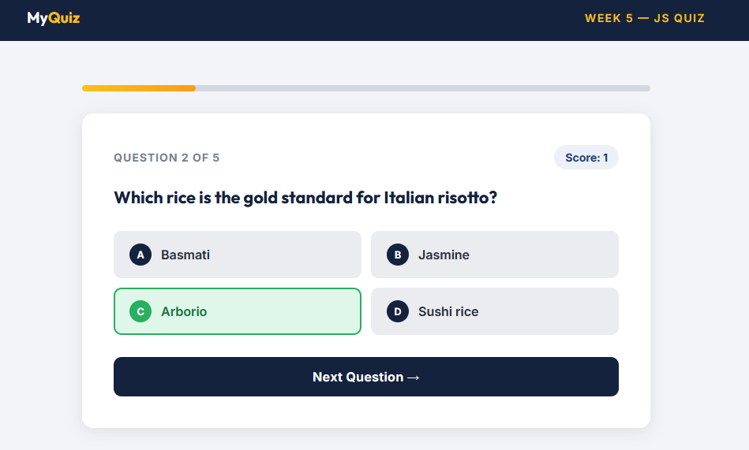

# Culinary-Arts-Quiz

An interactive quiz application that showcases my progress in mastering front-end development, specifically focusing on complex JavaScript logic and DOM manipulation.

## Live Site
[View Portolio on GitHub Pages](https://hanari-dev.github.io/Culinary-Arts-Quiz/)

## Languages
* **HTML5:** Semantic structure, interactive forms, and accessibility-first design.
* **CSS3:** Flexbox, CSS Grid, custom animations, and mobile-first responsive design.
* **JavaScript:** DOM events, arrays, objects, loops, and persistent local storage.

## Project Structure
* `index.html`: Main Quiz Interface and Results screen.
* `styles/main.css`: Comprehensive styling for layout, responsiveness, and visual feedback.
* `app.js`: Core logic for quiz state, score calculation, grading, and DOM manipulation.

## Features & Concepts Learned
* **Semantic HTML:** Utilized `header`, `section`, and `footer` tags to create a clean, accessible layout.
* **Responsive Design:** Implemented media queries to ensure the app looks great on both mobile and desktop.
* **JavaScript Fundamentals:** * Managed quiz state using arrays and objects.
    * Used loops for dynamic button generation.
    * Implemented logic for `checkAnswer`, `calculateScore`, and `getGrade`.
* **DOM Interaction:** Dynamically injected content and applied conditional CSS classes for instant user feedback.
* **Bonus - High Score Tracking:** Leveraged `localStorage` to save and persist the user's all-time high score, demonstrating a practical use of persistent browser storage.
* **Bonus - Randomization:** Implemented a shuffle algorithm to ensure a unique quiz experience. 

## Screenshots

### Quiz Interface

### Results Screen

